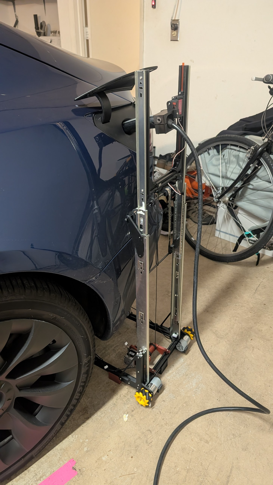
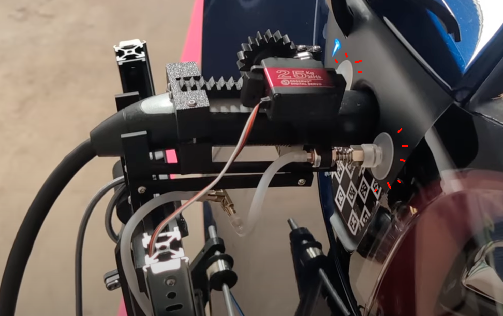
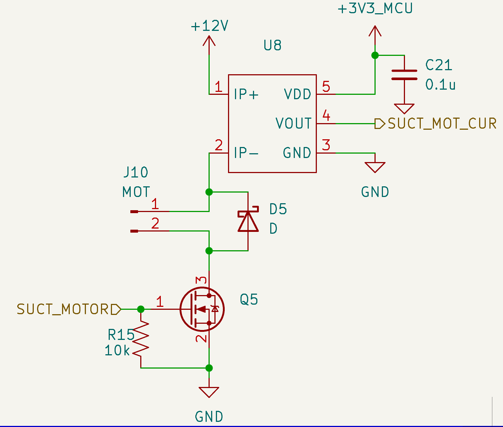
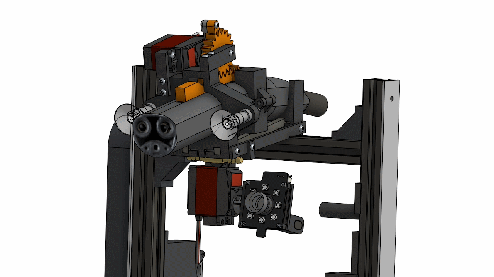
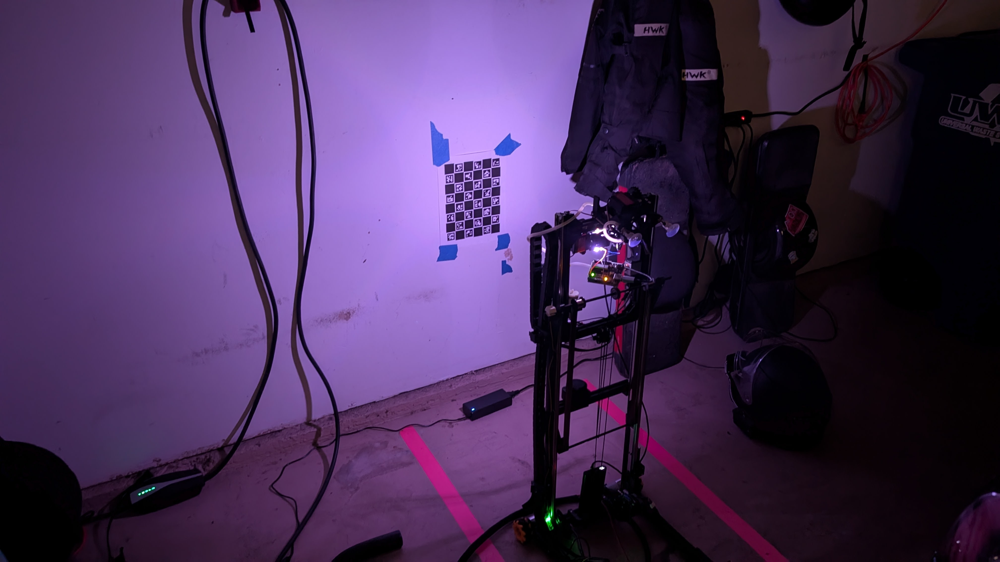
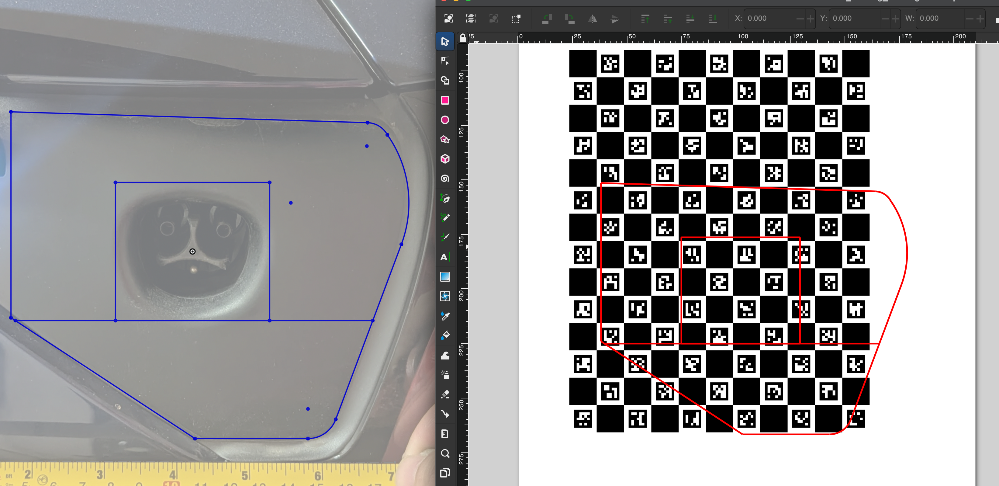
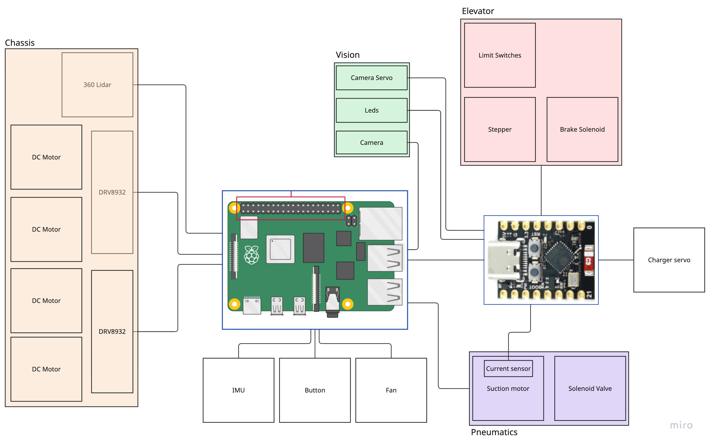
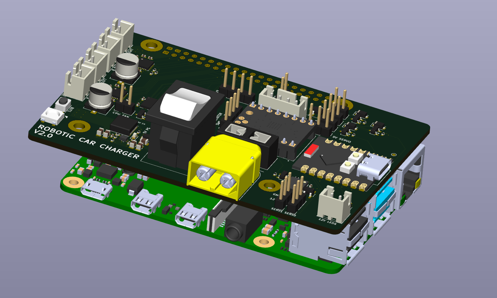
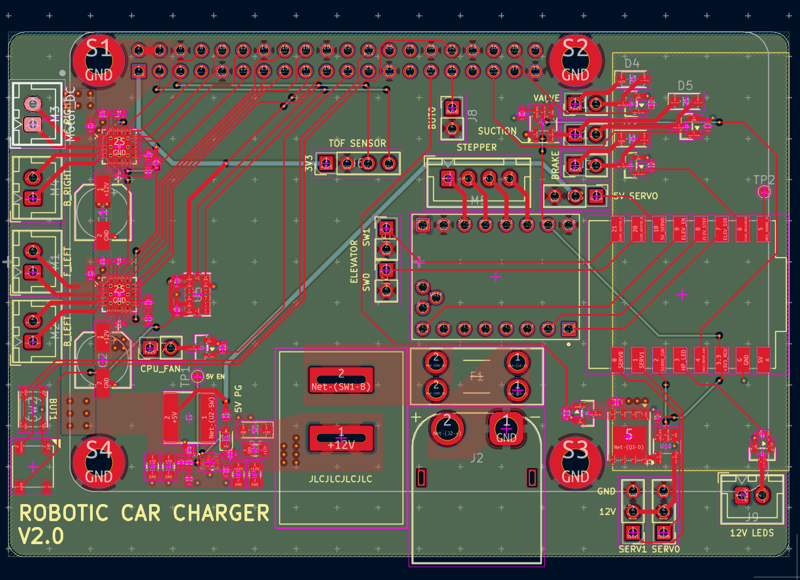
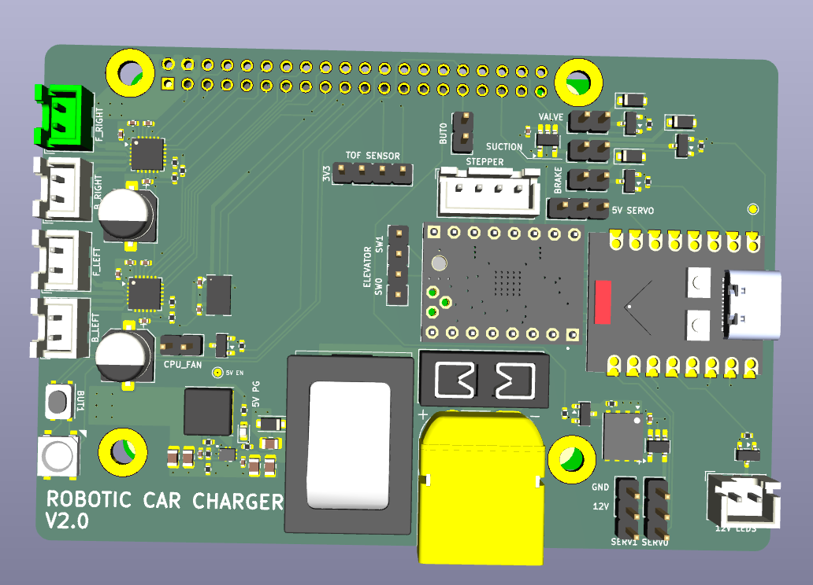

# Robotic Car Charger 
An realistic-to-use but slightly jank automatic car charging robot for the 2021 Tesla Model 3 using ChARuco vision tracking targets.

[Youtube video](https://www.youtube.com/watch?v=74ZmHtE3Kfs)


*Early prototype*

# Key Features
- Minimal "stick out" when plugged into the car. Most of the robot remains under the car during charging 
- Charging cable routes straight down to the ground. No cable to trip on
- 1-stage elevator to lower center of gravity when moving from homing position to the car 
- Mecanum drive for strafing alignment and versatility for different garages 

# Implementation details 
## Suction cups 
- Suction cups allow for minimal supporting structure during insertion. The car's surrounding charger port panel provides the resistive force to *plug* the charger in. Other designs of robots use the their chassis/weight, but this results in a lot of robot sticking out from the car when it is charging. It takes a considerable amount of force to actually plug these cars in, but we humans don't really notice it since we can take a supportive stance and we are kinda heavy.



- Suction cup motor trace runs through a current sensor. This is essential for determining whether the alignment on the charge port is correct, since the current drops once a proper vacuum has formed.



## Tracking  
This robot does not use SLAM, instead pre-programmed movement code fused with lidar readings gets the robot roughly into position, and then it runs pose tracking with a 1080p camera for final alignment. SLAM is overkill for the total traversal distance of about 2 meters.

### Camera
The camera and leds spins on a turret to align with the charge port and then the back wall without needing to turn around. 


### LEDS
A separate pcb mounts to the camera and contains 8 front firing neopixels and 2 rear firing neopixels. These provide lighting and indiciation of what is happening. 


Simple closed loop code changes the led brightness until the brightness of the frame is an ideal value for the camera during tag alignment.

### Tags
This robot needs the *pose* to align normal to the charge port. This means x, y, z AND the roll, pitch, yaw must be gathered. I found that a single April tag induces too much pose uncertainty which really hurts alignment performance. Once I switched to a ChARuco board, tracking was much more stable and accurate.

I took a photo of the available area of the charge port and drew lines in onshape (left) and then imported the dxf into inkscape (right) to overlay the cut lines with the board.


## Integration with the car
I tried to work directly with the Tesla Fleet API, but it was a headache. The Tessie API is paid but worked instantly and was a breeze to use. 

Other than the obvious needs for this robot to send commands like `open_charge_port` and `unlock_charge_port`, I use the api to help determine if the criterias are met to automatically plug in the car.

1) Does lidar detect something in range 
2) Did car leave geofence at some point? (Detect car actually left home and then came back)
3) Is car reporting 
    - at home 
    - charge state == disconnected
    - shift state is in park


## Hardware
The heart is a RPI 5 8gb and an ESP32C3 on a custom pi hat. This hat also connects the input power (12v) to all modules on the board.



# Files
## CAD Files 

[Onshape Link](https://cad.onshape.com/documents/88ee021874581cb18dc6c8d8/w/3a316df21d6ad6d843a25521/e/77d4f15c486d11acf236a6b2?renderMode=0&uiState=6a0ebbc17fa8db9c7a94576a)

## PCB




# Previous at-home implementations 
## Tesla's snake robot
https://www.youtube.com/watch?v=uMM0lRfX6YI
##  Auto voltek
https://www.youtube.com/watch?v=DjvgSQggTFY
## Tesla Automatic Charger 
https://www.youtube.com/watch?v=octvXMaTG44
## Viam's "Autonomous Charger"
https://www.youtube.com/watch?v=1O4bXocMj0A

# Commands for me:
## platformio
### Installation
`sudo apt install pipx`
`pipx ensurepath`
`source ~/.bashrc`
`pipx install platformio`

### build & run
`pio run`
`pio run -t upload`
`pio device monitor`
`pio run -t upload -t monitor`
`pio device list`

## Headless
nohup python3 main.py > output.log 2>&1 &

pkill -f main.py

## github corruption 
```
find .git/objects -type f -empty -delete
git fetch origin
git update-ref refs/remotes/origin/main $(git ls-remote origin HEAD | cut -f1)
git fsck --full
git branch --set-upstream-to=origin/main main
git pull origin main
```